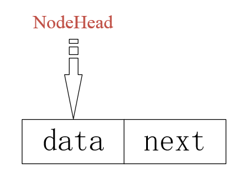
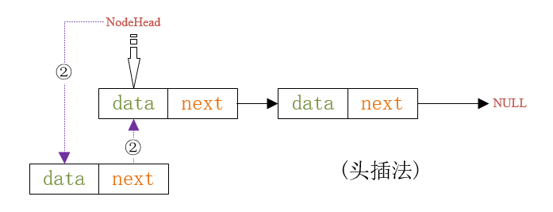
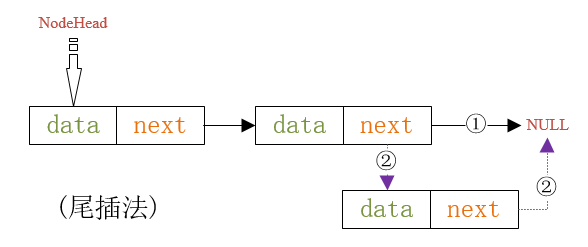

@[TOC](线性表操作)

# 基本操作总结
- 创建线性表
- 销毁线性表
- 清空线性表
- 插入元素到线性表
- 删除线性表中元素
- 取出线性表中元素
- 获取线性表长度

# 顺序存储结构
# 一 线性表
>指用一段地址连的存储单元依次存储线性表的数据元素
 可用一维数组实现
**优点**：  
	- 无需为线性表中的逻辑关系增加额外的空间  
	- 可以快速的获取表中合法位置的元素，支持随机存取  
**缺点**：  
	- 插入和删除操作需要移动大量元素  
	- 当线性表长度变化较大时难以确定存储空间的容量  
## 1.1 创建线性表
```
typedef struct SeqList{
	int capacity; /* 总容量大小 */
	int length; /* 当前线性表尾指针 */
	data_t data[];
}T_SeqList,*PT_SeqList; /* 定义柔性数组 */
```
>建立时为柔性数组分配内存
```
SeqList* SeqList_Create(int capacity) /* 创建线性表(创建柔性数组) */
{
	PT_SeqList ret = NULL;
	if(capacity > 0)
	{
		ret = (PT_SeqList)malloc(sizeof(*ret) + sizeof(*(ret->data))*capacity);
		assert(NULL != ret);
		ret->capacity = capacity;
		ret->length = 0; /* 未存放数据 */
	}
	return ret;
}
```
## 1.2 插入元素到线性表
>选定插入的位置，对位置进行合法性判断 -> 将插入位置后面的数据元素后移一位 -> 将数据填充入线性表
```
int SeqList_Insert(SeqList* List, SeqListNode* node, int pos)
{
	/* 将插入元素后面的元素后移一个位置->将新元素加1->线性表长度加1 */
	PT_SeqList ptList = (PT_SeqList)List;
	assert(ptList != NULL);
	int ret = -1;
	int i = 0;
	
	if((ptList->length + 1 <= ptList->capacity) && (0 <= pos))
	{
		if(pos >= ptList->length)
		{
			pos = ptList->length;
		}
		
		for(i=ptList->length; i>pos; i--)
		{
			ptList->data[i] = ptList->data[i-1]; /* 后移赋值 */
		}
		
		ptList->data[i] = (*(data_t *)node);
		
		ptList->length++;
		
		ret = 0;
	}

	return ret;
}
```
## 1.3 获取某个位置的数据
>这里是将该数据的地址取出来，传送出去，获取具体数据时进行取值
```
SeqListNode* SeqList_Get(SeqList* List, int pos)
{
	PT_SeqList ptList = (PT_SeqList)List;
	SeqListNode* ret = NULL;
	
	assert(ptList != NULL);
	
	if((0 <= pos) && (pos < ptList->length))
	{
		ret = (SeqListNode *)&(ptList->data[pos]);
	}
	return ret;
}
```
## 1.4 删除某个位置的数据
```
SeqListNode* SeqList_Delete(SeqList* List, int pos)
{
	PT_SeqList ptList = (PT_SeqList)List;
	SeqListNode* ret = SeqList_Get(List, pos);
	
	assert(ret != NULL);
	
	for(int i=pos+1; i<ptList->length; i++)
	{
		ptList->data[i-1] = ptList->data[i];
	}
	
	ptList->length--;
	
	return ret;
}
```


# 链式存储结构
# 二 单链表
>n个结点链接成一个链式线性表的结构叫做链表，当每个结点中只包含一个指针域时，叫做单链表。
## 2.1 基本概念
>单链表中包含数据域与指针域，总体而言，基本概念有以下三点  
	① 表头结点：链表中的第一个结点，包含指向第一个数据元素的指针以及链表自身的一些信息  
	② 数据结点：链表中代表数据元素的结点，包含指向下一个数据元素的指针和数据元素的信息  
	③ 尾结点：链表中的最后一个数据结点，其下一元素指针为空，表示无后继  
	链表形式有两种：
---
*无头单链表*
---

---
*带头单链表*
---

---
	数据插入方式有两种
*头插*
---

---
*尾插*
---

---
**优点**：  
	- 无需一次性定制链表容量  
	- 插入/删除无需移动数据元素  
**缺点**：  
	- 数据元素必须保存后继元素的位置信息  
	- 获取指定数据时需要顺序访问之前的元素  
## 2.2 创建单链表

# 三 静态链表
## 3.1 基本概念
**优点**：  
	- 插入/删除时，只需移动游标  
**缺点**：  
	- 无法随机存取  

# 四 循环链表
## 4.1 基本概念
**优点**：
**缺点**：

# 五 双向链表
## 5.1 基本概念
**优点**：
**缺点**：


	
	